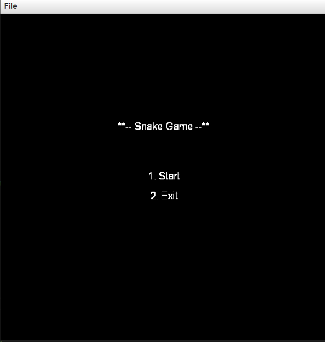
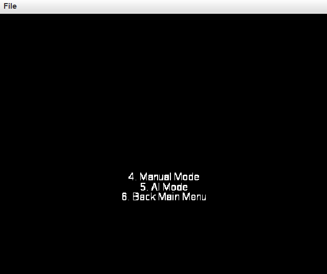
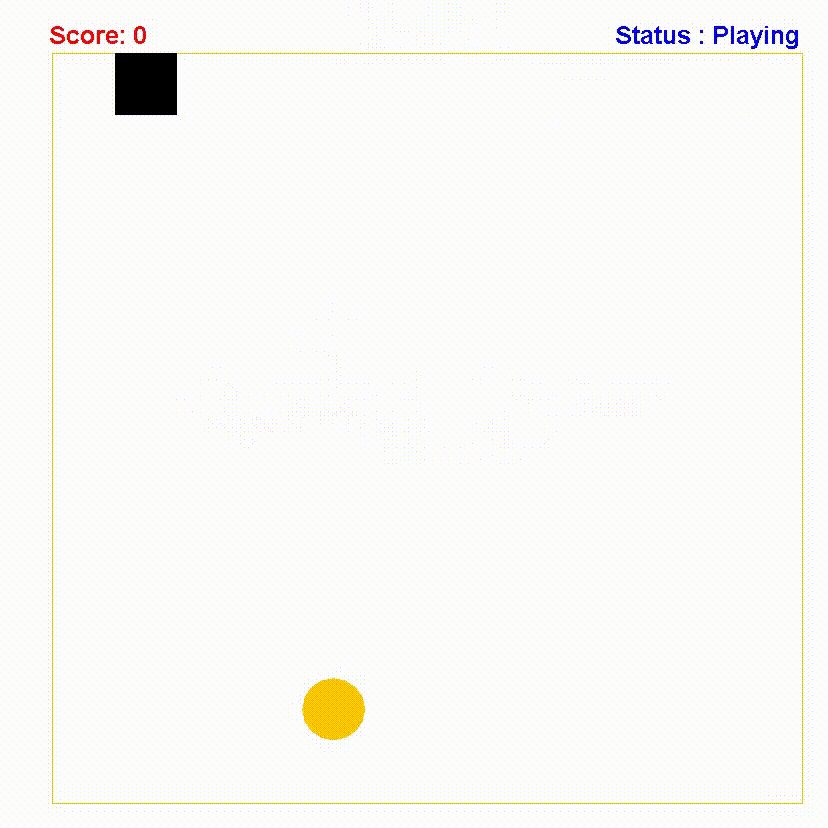
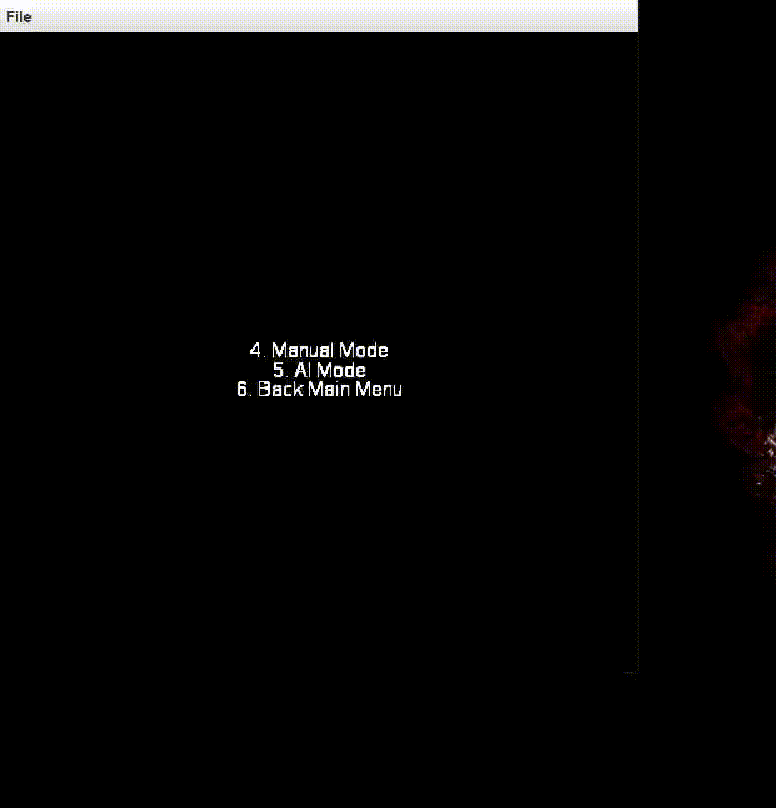

# Snake Game - Two modes
> **Author:**
> [Badr Tajini](https://scholar.google.fr/citations?user=YuxT3tYAAAAJ&hl=en) <br>

# Abstract
This snake game includes two modes:
- Manual
- AI

The manual mode is playable like the standard snake game with pretty much the same rules.
The AI mode features three algorithms:
Best First Search, A* Search and A* Search improved with forward checking.

# How to play :
> The source code would be sent if a request is received.

Run the ``` StartFullGame.java ```  file located in the ```UI folder``` to start the game menu and select between the two modes.

If you select the manual mode:
- Use the left, up, down and right buttons of your keyboard to control and navigate your snake.
- Use the space button to pause or resume the game.
If the snake crosses the border or hits itself, the game is over.

If you select AI mode:

- The game is automatically played until the end. There may be an anti-death cycle, after 5 attempts without eating the apple. If the fifth attempt is reached without getting any available apple, the game is over. 

# Contents of the project

- AI : Files used to launch the AI mode
- Manual : Files used to launch the Manual mode
- Mode : Files used to support the AI mode
- UI : Files used to launch the Main Menu
- utils : File used to draw patterns and calibrate the Main menu (from cs.princeton.edu and updated for our own use)

<p align="center">
     <br />
    <em>
    Figure 1: Game UI Starter.
    </em>
</p>

<p align="center">
     <br />
    <em>
    Figure 2: Game Menu.
    </em>
</p>


# Snake-Manual

Concretely, our implementation involves a snake running on a squared board, while attempting to eat as many apples as possible without dying.  
Once the snake has eaten an apple, a new apple is positioned randomly on the panel and the length of the snake increases by one unit.   
When the snake has no choice except for biting itself or hitting the borders, the game is over and a final score is returned. 

<p align="center">
     <br />
    <em>
    Video 1: Manual Mode.
    </em>
</p>


# Snake-AI

Snake AI is based on three search algorithms related to the field of heuristic optimization (AI), namely: Best First Search, A* Search and A* Search enhanced with forward checking.

In our implementation, we simply compute the score as the number of apples the snake has eaten.
Here are some basic rules followed by our implementation:  

1. The purpose of the game is to eat as many apples as possible by the snake, following finite steps.   
    The first priority of the snake is to keep its body and borders out of the way, while the second is to increase the score.  
2. There are four possible directions in which the snake can move: Top, Down, Left, Right.   
3. The snake grows one unit when it eats an apple.   
4. The size of the board is fixed to the square.  
5. After an apple is eaten by the snake, another apple is randomly positioned with uniform probability on an available square on the board.     

### 1. Best First Search

The Greedy Best-First Search algorithm has a one movement perspective and only considers the nearest position to reach the apple's position We use the Manhattan distance to define the proximity of the snake's head to the apple.  Finally, this method will cease to be optimal when the snake has eaten more than four apples.


### 2. A* Search
A* embeds a heuristic approach in a multiple movement perspective. Before proceeding, it considers not only where the apple is and how far away it is, but also the current position it has been searching for before as well as how far away it is at the current time T.
This A* algorithm uses the Manhattan distance between the head and the apple as a heuristic approach and the number of steps as the "cost".
Each iteration of the algorithm lasts until a path is found that leads the snake to eat an apple. Also without memory or time restrictions, the algorithm is guaranteed to find an optimal path to the apple if one exists.
However, the maximum number of nodes expanded is limited. This causes the algorithm to stop if a path to the apple cannot be found (for any reason). 

### Pseudocode
``` 
if (can eat food):
      function: Send a snake to eat apple,                              -(1)
             If (after eating can follow the tail) redo (1)             -(2)
             If (can not follow the tail after eating) redo (2)         -(3)
else
     function: Snake follow the tail
if (can not eat food can not follow the tail): 
      function: Random walk, after 5 attempts without eating = Game over.
```


### 3. A* Search with Forward Checking
The A* algorithm has a weakness that we call a dead-end cycle. Specifically, it does not always take into account the best of the chosen path once the apple is eaten.
To avoid these dead-end cycles, the A* algorithm is also built with a Breadth First Search algorithm which is used to compute whether a path to a target (an apple) also leads to a dead end. When an iteration of the A* algorithm is completed, the Breadth First Search algorithm is called as a backup. This dead-end checking is also used when the A* with Forward checking algorithm cannot find a path to the apple. 

<p align="center">
     <br />
    <em>
    Video 2: AI Mode.
    </em>
</p>


## Citation
If you find this repository useful in your educational project or research, please cite:
```
@software{badr_tajini_0621,
  author       = {Badr Tajini},
  title        = {Snake-Game-Two-Modes},
  month        = jun,
  year         = 2021,
  url          = {https://github.com/BTajini/Snake-Game-Two-Modes}
}
```
